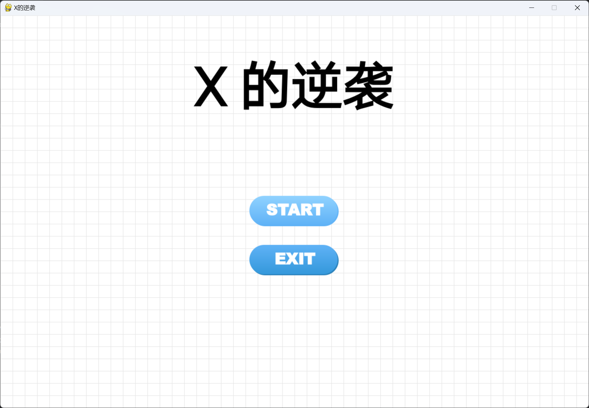
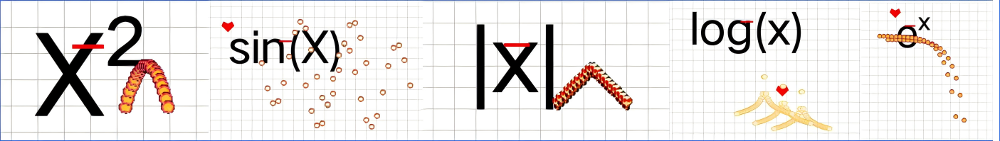
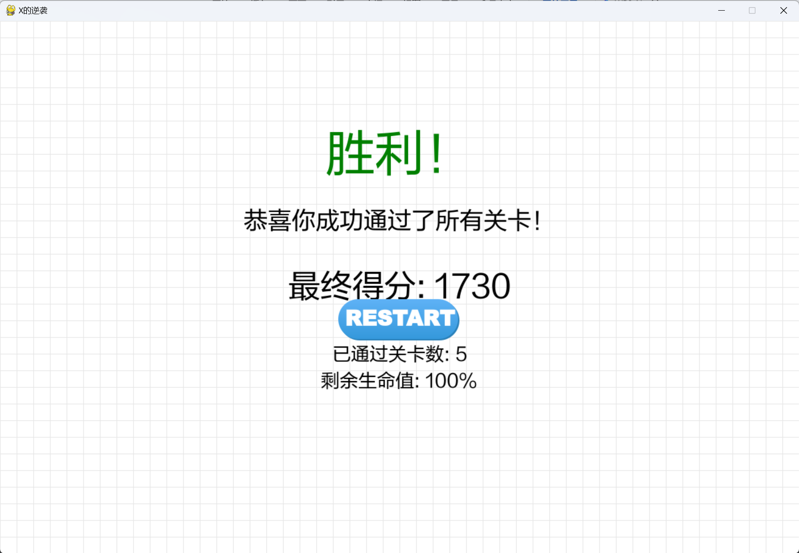
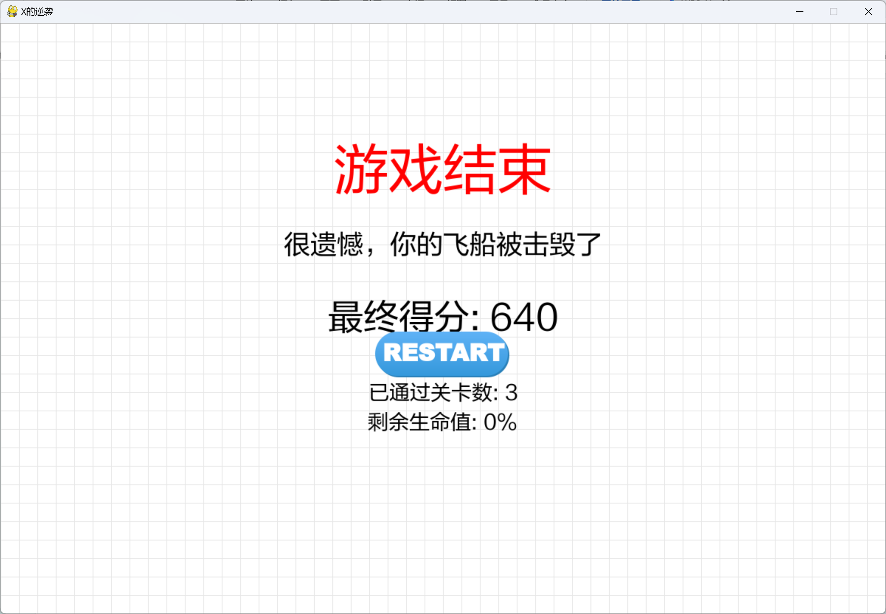

# x的逆袭：数学函数主题射击游戏

## 游戏类别
- 类型：2D垂直卷轴射击游戏
- 原型参考：经典游戏《飞机大战》
- 创新点：数学函数可视化，教育性与娱乐性结合

## 游戏核心
- 玩家通过鼠标操控主角"X"与遵循不同数学函数轨迹的敌机对战
- 基于坐标系的可视化战斗系统
- 融入数学教育元素的关卡设计

## 游戏玩法设计

### 基础机制
- 总共五个关卡
- 动态背景的实现
- 主角发射直线型子弹(y=x)
- 敌机发射特殊函数型子弹
- 道具机制(血量/强化）
- 子弹与子弹之间的碰撞抵消
- 关卡进阶：函数从简单到复杂
- 击败敌机即可获胜

### 关卡规划
- 第一关：y=x²
- 第二关：y=sin(x)（正弦波）
- 第三关：y=|x|（绝对值）
- 第四关：y=log(x)（对数）
- 第五关：y=e^x（指数）

## 技术实现方案

### 开发环境
- 编程语言：Python 3.11
- 游戏框架：Pygame
- 开发工具：PyCharm

### 核心技术模块
- 碰撞检测系统
- 数学函数轨迹生成
- 粒子效果系统
- 平滑移动算法

## 重点与难点

### 技术重点
- 数学函数的计算与实现
- 平滑的敌机移动
- 精确的碰撞检测实现

### 预估难点
- 如何平衡游戏难度与趣味性
- 实现良好的画面表现力
- 不同函数子弹的视觉表现
- 性能优化，确保流畅运行

## 预期成果

### 目标成果
- 完整的五关关卡游戏系统
- 流畅的游戏体验
- 清晰的画面效果

### 当前的进展
- 完成游戏首页的制作
- 完成游戏的基本框架

### 成果图

